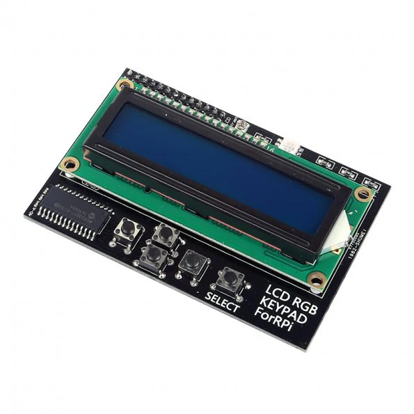

# char_lcd_rgb_i2c

A Rust library for controlling RGB1602 LCD displays connected to Raspberry Pi via MCP23017 I/O expanders.

[](https://crates.io/crates/char_lcd_rgb_i2c)

## Overview

This project is a Rust port of a [Go implementation](https://github.com/jyap808/charLCDRGBI2C) for interfacing with RGB1602 LCD displays using the MCP23017 I/O expander chip. The MCP23017 communicates with the Raspberry Pi via I2C protocol, providing additional GPIO pins to control the LCD, backlight, and RGB LED.

Key features:
- Control 16x2 character LCD displays
- Backlight control
- RGB LED control
- Support for 5 built-in buttons
- I2C interface (default address: 0x20)

## Background

This library was developed for a specific RGB1602 LCD board with the following features:
- I2C Interface (Address: 0x20)
- LCD 16x2 Characters
- 5 Buttons
- 1 RGB LED
- Uses MCP23017



While similar to the [Adafruit 16x2 Character LCD Plus Keypad for Raspberry Pi](https://learn.adafruit.com/adafruit-16x2-character-lcd-plus-keypad-for-raspberry-pi), this board has different backlight functionality which this library specifically addresses.

## Usage

Basic example:

```rust
use char_lcd_rgb_i2c::{CharLCDRGBI2C, LcdError};
use std::{thread::sleep, time::Duration};

fn main() -> Result<(), LcdError> {
    // Initialize a 16x2 LCD
    let mut lcd = CharLCDRGBI2C::new(16, 2)?;
    
    // Set backlight and display some text
    lcd.set_backlight(true)?;
    lcd.set_color(100, 0, 0)?;  // Red
    lcd.message("Hello, world!\nFrom Rust!")?;
    
    sleep(Duration::from_secs(2));
    
    // Change LED color to blue
    lcd.set_color(0, 0, 100)?;
    
    Ok(())
}
```

See the `examples/lcd_demo.rs` file for a more comprehensive example.

## Requirements

- Raspberry Pi or compatible single-board computer
- Rust 2021 edition or newer
- `rppal` crate for Raspberry Pi GPIO access
- MCP23017 I/O expander
- RGB1602 LCD display

## Cross-Compilation

For cross-compiling to Raspberry Pi, add this to your `.cargo/config.toml`:

```toml
[target.armv7-unknown-linux-gnueabihf]
linker = "armv7l-unknown-linux-gnueabihf-gcc"
# Required for NixOS
rustflags = [
  "-C", "link-arg=-Wl,-dynamic-linker=/lib/ld-linux-armhf.so.3"
]
```

Then build with:
```bash
cargo build --target armv7-unknown-linux-gnueabihf
```

## Origins and Credits

This library is a Rust port created as an exercise in library development and cross-language porting. The implementation is inspired by the [Adafruit CircuitPython CharLCD Library](https://github.com/adafruit/Adafruit_CircuitPython_CharLCD).

## License

[MIT License](LICENSE)
